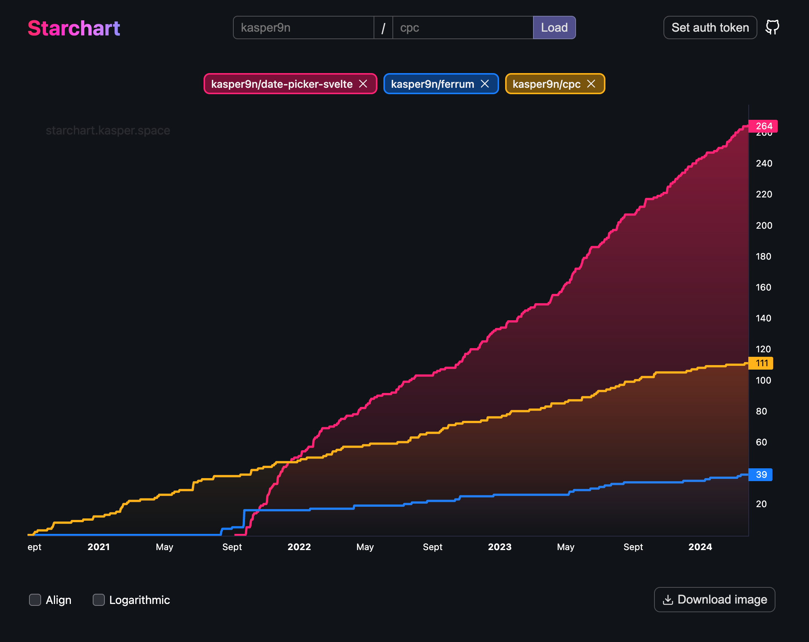

# Starchart

GitHub star history graph.

Uses [daily-stars-explorer](https://github.com/emanuelef/daily-stars-explorer) for caching stars.

## Commands

- `npm run dev`: Start in dev mode
- `npm run build`: Build
- `npm run preview`: Preview production app
- `npm run lint`: Lint
- `npm run format`: Format
